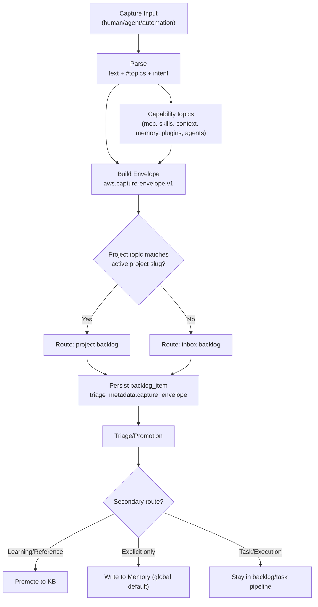

# Capture Pipeline Visual

## Notes

- `mcp` is treated as a topic/category label, not dependency relation.
- Primary target remains backlog-first for low-friction capture.
- Memory stays explicit/manual until memory workflow is stable.
